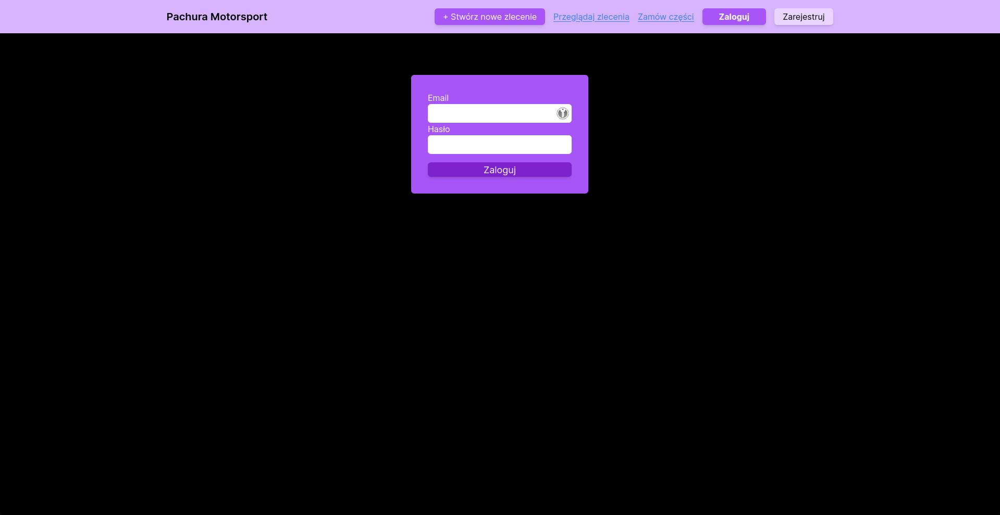
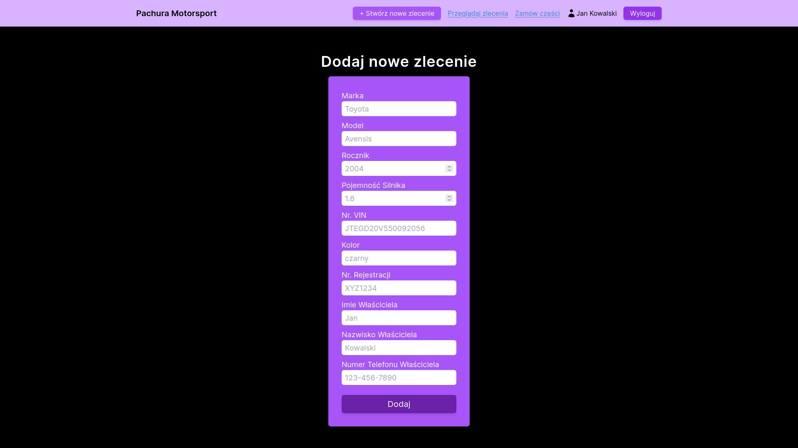
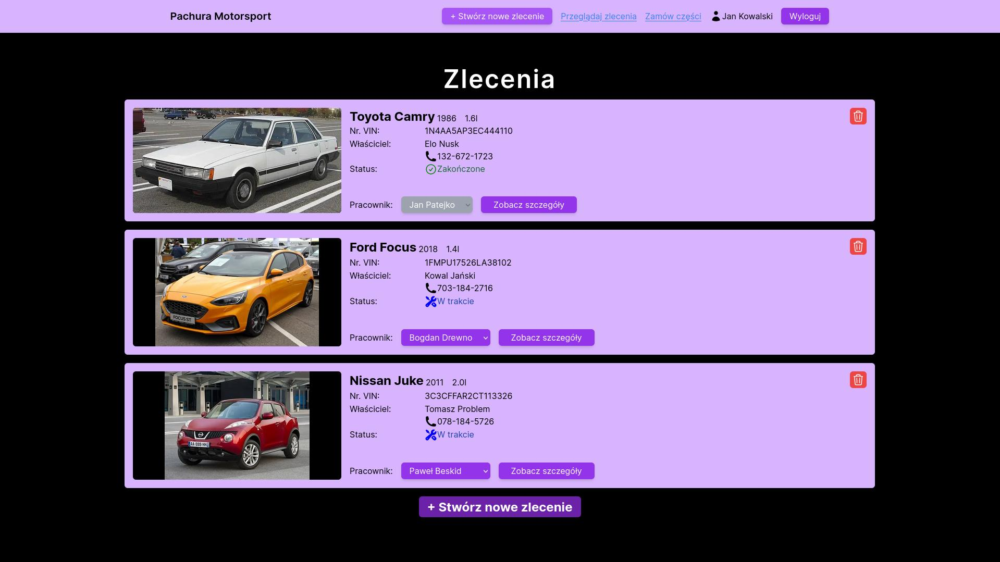
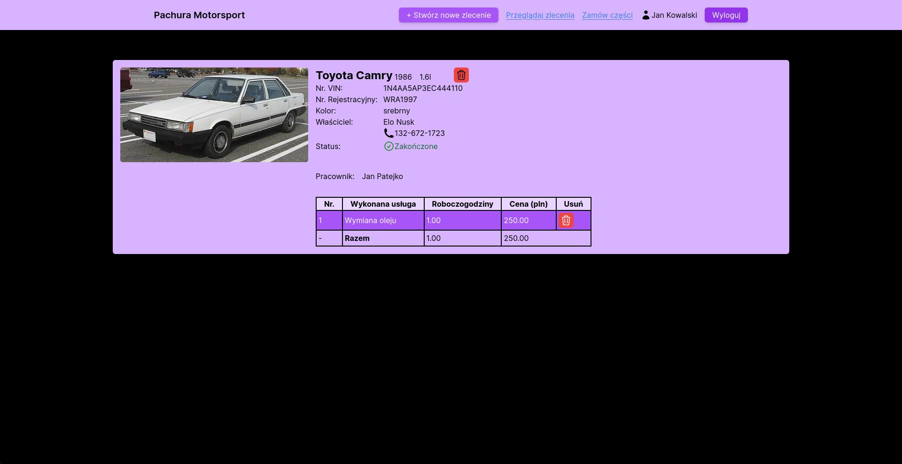
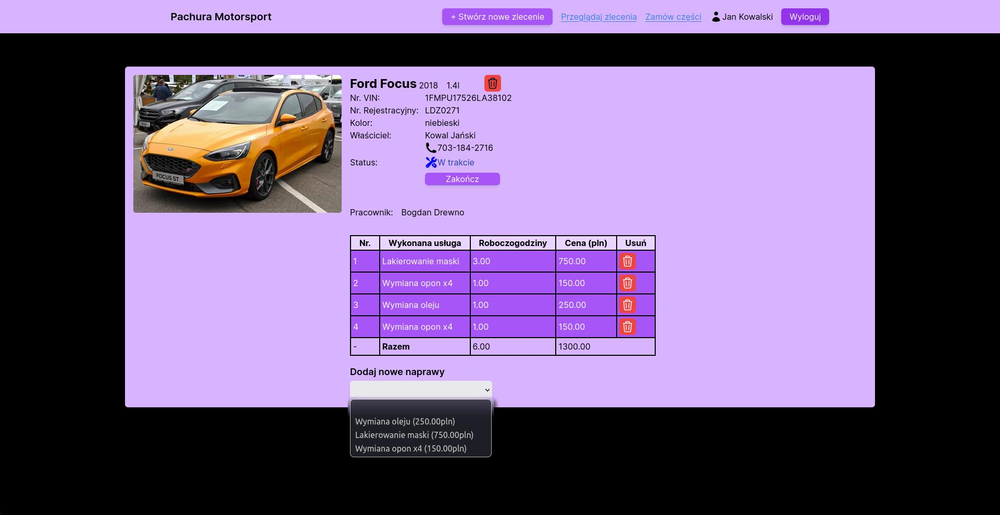

# Automotive Workshop Management System
simple website for managing automotive repair shop using NextJS, Tailwind and SQLite

## Features
- add new cars
- add service jobs
- assign workers to each car
- sum up costs of service

## Usage
```
git pull https://github.com/NxtPerfect/automotive-workshop-management-system
cd automotive-workshop-management-system
npm i next
npm run dev
```

## Preview






